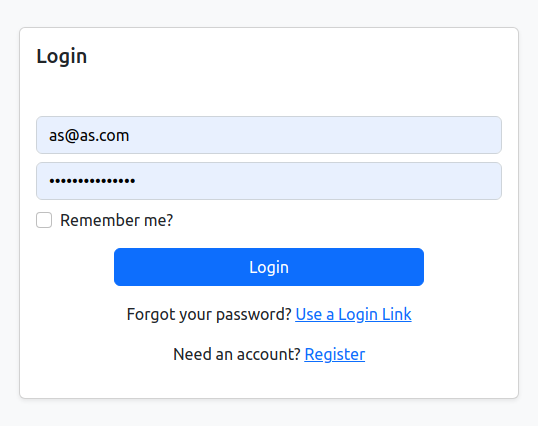
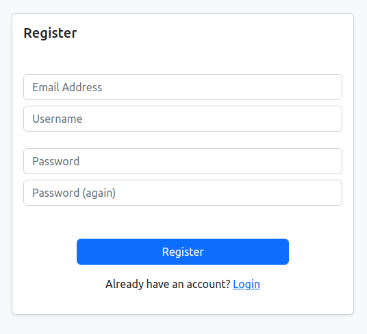
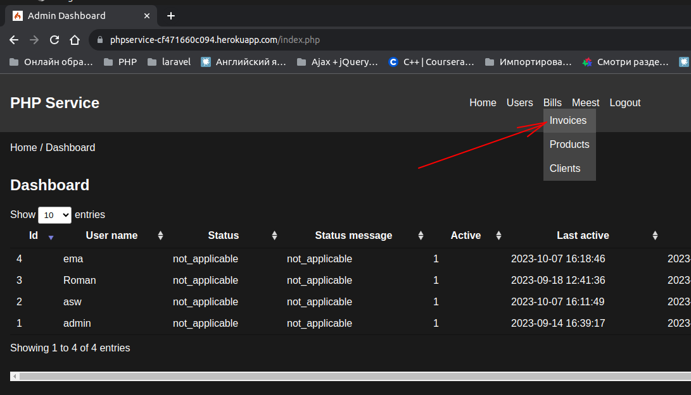
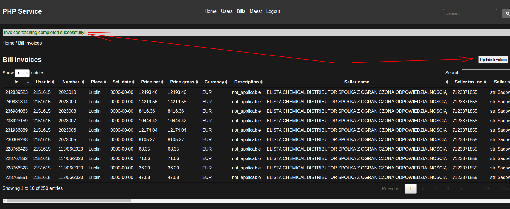
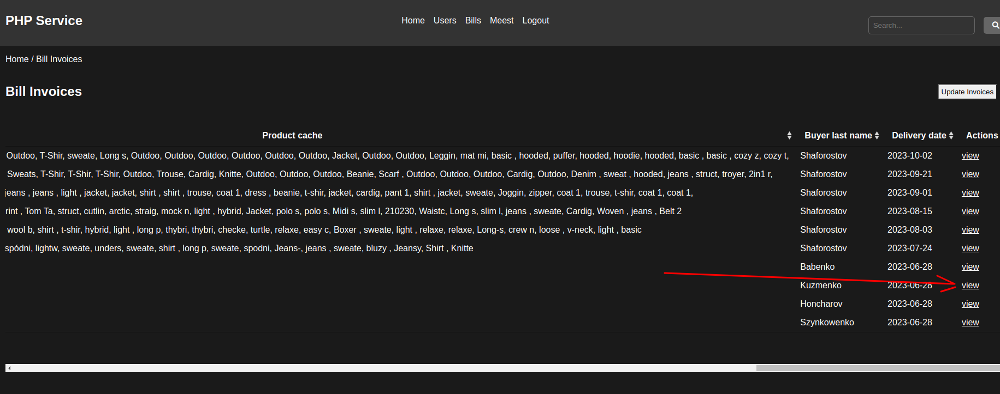
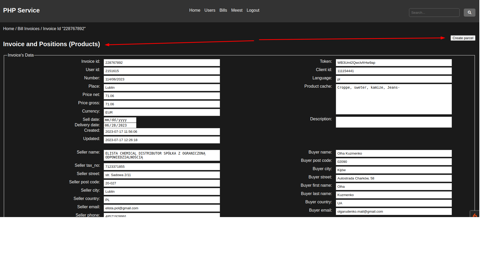
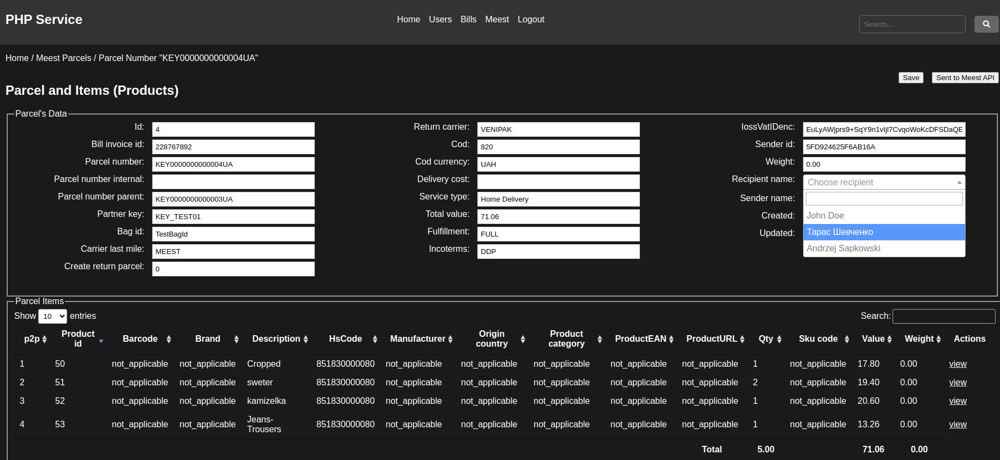
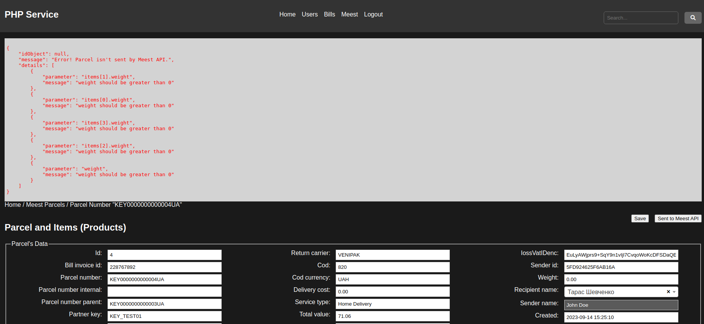

# PhpService

**PHPService** is a diploma project for **IT Step Academy**, it is an **MVP project** of a website for automating import documentation processing.

## Description

The **PhpService** project is a **PHP 7** web service that:
1. links three external APIs:

   **BillAPI** - invoice processing web service [elista.fakturownia.pl](https://elista.fakturownia.pl),

   **CustomAPI** - web service of carrier and customs agent [MEEST WORLD LOGISTIC API](https://documenter.getpostman.com/view/12823986/TzCTam5v#d22902c6-e416-4e37-8d1a-ac2e610cccee).

   **SalesAPI** - web service of sales accounting (in plans, this functionality is not implemented).

2. automates the processing of documents for customs clearance **CustomAPI** on the basis of data from the accounting service **BillAPI**.

## Basic requirements for functionality

- **PHP 7**, based on **CodeIgniter 4** framework.

- Authentication and user authorisation based on **CodeIgniter Shield library**.

- Data from external APIs should be processed and stored in **MySQL **database.

- **PhpService** should pass the information received from **BillAPI** to **CustomAPI**.

- **PhpService** should update the order status in the local database depending on the response from **CustomAPI** (planned, not implemented).

- **PhpService** API should provide **GET /status** method to get current order status by its ID (planned, not implemented).

- **PhpService** should log all requests and responses from API, as well as errors and exceptions to log files.

- On the frontend, use JavaScript libraries **DataTables** and **Select2** to process and display data.

## Technologies Used

**PhpService** is built using the following technologies:

- **CodeIgniter 4**: The core framework that powers PhpService.

- **CodeIgniter Shield**: A security extension for CodeIgniter that enhances protection against common web vulnerabilities.

- **DataTables**: A powerful jQuery plugin for interactive data tables in the application's frontend.

- **Select2**: A jQuery-based replacement for select boxes, enhancing the user experience when selecting items.

- **phpDocumentor**: is an application that is capable of analyzing PHP source code and DocBlock comments to generate a complete set of Documentation.

## User Stories

This section outlines the user stories and provides a step-by-step guide on how to use PhpService:

### 1. Free Registration

- Users can start by registering for the service for free.

### 2. Navigating to Invoices

- After registration, users should navigate to the "Bills -> Invoices" section.

### 3. Updating Invoices

- In the "Bills -> Invoices" section, click the "Update Invoices" button to fetch the latest data regarding newly created invoices.

### 4. Viewing a Specific Invoice

- Select the desired invoice from the list and click the "view" link at the end of the row to access the details for that specific invoice.

### 5. Creating a Parcel

- In the top-right corner of the invoice details page, click the "Create Parcel" button.

### 6. Working with Parcels.

- Now, you are in the "Parcels" section.

- In the parcel editing window, start by selecting the recipient of the parcel. This can be done in the "Recipient name" dropdown, located in the top-right corner or the third column of the Parcel's Data section.

- Make any necessary changes to the parcel details.

- Click the "Save" button, located in the top-right corner of the parcel editing window.

### 9. Sending Data to Custom API

- To send the data about the new parcel to the carrier's API, click the "Sent to Meest API" button.

- As a response from the carrier's API, you will receive either a list of remarks, specifying the field and nature of the remark, or a message confirming the successful creation of a record for the new parcel.

## Project documentations
Project docs available by [link](https://vladar21.github.io/PhpServiceDocs/)

## User Goals

The primary goals for users of this website are:

1. **Retrieve Invoices**: Users can fetch invoices from BillAPI and work with them in the "Bills" section, which includes sub-sections for "Invoices," "Products," and "Clients."

2. **Manage Parcels**: Users can create parcels associated with specific invoices and continue working with them in the "Meest" section, comprising sub-sections for "Parcels," "Items" (products), and "Clients."

3. **Send Parcel Data**: Within a parcel, users can submit completed data to MeestAPI. MeestAPI responds by confirming successful data receipt or providing a list of fields with errors.

## Features

- **Data Import**: PhpService seamlessly imports data from BillAPI and prepares it for further processing. Users can view invoices, products, and client details in a user-friendly interface.

- **Parcel Management**: Users can create and manage parcels associated with invoices. The system ensures the smooth flow of data from BillAPI to MeestAPI.

- **Error Handling**: The application includes robust error handling mechanisms. Users receive clear notifications in case of issues with data submission or other processes.

- **Logging**: PhpService includes comprehensive logging capabilities. It logs requests to and responses from external APIs, as well as errors and exceptions occurring during application operation. Logging is managed using [log library name, e.g., Monolog], which writes data to log files. Configuration settings for the logger can be adjusted in the [configuration file name, e.g., log_config.php]. To view logs, navigate to the logs directory in the project's root directory and open the corresponding log file.

- **Extensibility**: PhpService is designed for extensibility. Future enhancements can include connecting a third external API, SalesAPI, to update sales statistics. Additionally, the service aims to provide users with their own API (PhpServiceAPI) for real-time order status updates and forwarding external API error messages.

## Future Enhancements

Here are some future enhancements planned for PhpService:

1. **Integration with SalesAPI**: Connect the SalesAPI to update sales statistics automatically. This enhancement will provide users with valuable insights into their sales data.

2. **PhpServiceAPI for Users**: Develop a dedicated API, PhpServiceAPI, for users to check the current status of their orders and receive error messages from external APIs in real-time.

## Contribution

- Many thanks to **IT STEP Academy** for the opportunity to realise personal potential in a real project.

- Special thanks to **Maxim Valentinovich Shaptala** for his constant help and support in all matters.

## License

PhpService is licensed under the [Creative Commons Attribution-NonCommercial 4.0 International License (CC BY-NC 4.0)](https://creativecommons.org/licenses/by-nc/4.0/).

It means you are free to use, modify, and distribute this project under the following conditions:

- You must give appropriate credit, indicating the original author or source as specified by the original project.
- You are not allowed to use this project for commercial purposes without obtaining permission from the copyright holder.

---

This README file is a concise guide to the PhpService project, providing an overview of its features, installation instructions, future plans, and more.
