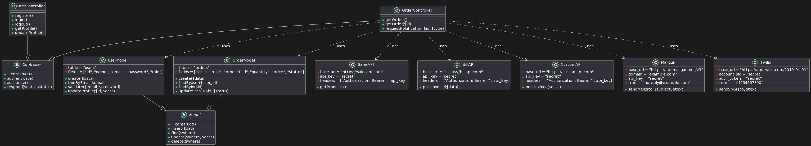

# PhpService

Проект по созданию PhpService - это бекенд сервис на языке PHP 7, который связывает три внешних API: BillAPI, SalesAPI и CustomAPI, и предоставляет свой собственный API (PhpServiceAPI) для информирования пользователя о текущем состоянии заказа и перенаправления сообщений об ошибках.

## Описание связываемых API

- BillAPI:
API веб-сервиса по созданию счетов-фактур. По запросу от PhpService, BillAPI возвращает набор данных, содержащихся в имеющихся и вновь созданных счетах-фактурах. Один счет-фактура является атомарной единицей заказа. BillAPI получает данные о проданных товарах от SalesAPI, затем подготавливает набор данных для счета-фактуры и отправляет этот набор данных в CustomAPI.

- CustomAPI:
API веб-сервиса по созданию таможенных накладных. PhpService передает набор данных заказа CustomAPI для создания или обновления таможенных накладных.

- SalesAPI:
API веб-сервиса статистики продаж. PhpService передает набор данных заказа SalesAPI для обновления статистики продаж.

## Функциональные требования

- PhpService должен быть реализован на языке PHP 7 с использованием стиля ООП в программировании на PHP.
- PhpService должен использовать фреймворк CodeIgniter 4 для создания веб-приложения и RESTful API.
- PhpService должен поддерживать аутентификацию и авторизацию пользователей с помощью JWT (JSON Web Token).
- PhpService должен регулярно опрашивать BillAPI для получения набора данных вновь созданного или обновленного заказа и сохранять его в локальной базе данных MySQL.
- PhpService должен передавать полученную от BillAPI информацию в CustomAPI.
- PhpService должен постоянно опрашивать CustomAP о статусе переданной информации.
- PhpService должен обновлять статус заказа в локальной базе данных в зависимости от ответа от CustomAPI.
- PhpService API должен предоставлять метод GET /status для получения текущего статуса заказа по его идентификатору.
- PhpService API должен предоставлять метод POST /notify для отправки уведомления пользователю по электронной почте или телефону о статусе заказа. Для отправки уведомлений PhpService должен использовать сервисы Mailgun и Twilio соответственно.
- PhpService должен логировать все запросы и ответы от API, а также ошибки и исключения в файлы журнала.

## Диаграмма классов

На диаграмме показаны основные классы, используемые в PhpService, их атрибуты и методы, а также связи между ними. Краткое описание каждого класса:

- **Controller** - абстрактный класс, который определяет общую логику для всех контроллеров в PhpService. Он наследует от базового класса CodeIgniter\Controller и содержит методы для проверки аутентификации и авторизации пользователя, а также для отправки ответов в формате JSON.
- **UserController** - класс, который отвечает за обработку запросов, связанных с пользователями. Он наследует от класса Controller и содержит методы для регистрации, входа и выхода пользователя, а также для получения и обновления профиля пользователя.
- **OrderController** - класс, который отвечает за обработку запросов, связанных с заказами. Он наследует от класса Controller и содержит методы для получения списка заказов пользователя, получения деталей заказа по его идентификатору, и запроса уведомления о статусе заказа по электронной почте или телефону.
- **Model** - абстрактный класс, который определяет общую логику для всех моделей в PhpService. Он наследует от базового класса CodeIgniter\Model и содержит методы для работы с базой данных MySQL с помощью библиотеки Query Builder.
- **UserModel** - класс, который отвечает за работу с данными о пользователях. Он наследует от класса Model и содержит методы для создания, поиска, проверки и обновления пользователей в базе данных.
- **OrderModel** - класс, который отвечает за работу с данными о заказах. Он наследует от класса Model и содержит методы для создания, поиска, обновления и удаления заказов в базе данных.
- **SalesAPI** - класс, который отвечает за взаимодействие с SalesAPI. Он содержит методы для отправки POST запросов к SalesAPI с данными о заказах.
- **BillAPI** - класс, который отвечает за взаимодействие с BillAPI. Он содержит методы для отправки GET запросов к BillAPI для получения данных заказов в формате JSON.
- **CustomAPI** - класс, который отвечает за взаимодействие с CustomAPI. Он содержит методы для отправки POST запросов к CustomAPI с данными о заказах и получения ответа о статусе таможенных накладных.
- **Mailgun** - класс, который отвечает за отправку уведомлений по электронной почте с помощью сервиса Mailgun. Он содержит методы для формирования и отправки сообщений по заданным параметрам: адресат, тема, текст и т.д.
- **Twilio** - класс, который отвечает за отправку уведомлений по телефону с помощью сервиса Twilio. Он содержит методы для формирования и отправки сообщений по заданным параметрам: номер телефона, текст и т.д.

## Product Backlog and sprints

|      | Product Backlog для проекта PhpService:                                                                                                                                                                                                                                                     | старт                | 25.06.2023 |
| ---- | ------------------------------------------------------------------------------------------------------------------------------------------------------------------------------------------------------------------------------------------------------------------------------------------- | -------------------- | ---------- |
|      |                                                                                                                                                                                                                                                                                             |                      |            |
|      | Наименование                                                                                                                                                                                                                                                                                | длительность, недель | срок       |
| 1    | Создание окружения разработки                                                                                                                                                                                                                                                               | 1                    | 01.07.2023 |
| 1.1  | Установка и настройка необходимого программного обеспечения, такого как веб-сервер (например, Apache), PHP 7, CodeIgniter 4, MySQL.                                                                                                                                                         |                      |            |
| 1.2  | Создать новый проект в CodeIgniter 4 и настройка его конфигурации                                                                                                                                                                                                                           |                      |            |
| 2    | Разработка классов моделей (UserModel, OrderModel)                                                                                                                                                                                                                                          | 1                    | 08.07.2023 |
| 2.1  | Создать абстрактный класс Model, наследуемый от базового класса CodeIgniter\\Model.                                                                                                                                                                                                         |                      |            |
| 2.2  | Создать классы UserModel и OrderModel, наследуемые от класса Model, для работы с данными о пользователях и заказах соответственно.                                                                                                                                                          |                      |            |
| 2.3  | В каждом классе реализовать методы для создания, поиска, обновления и удаления соответствующих записей в базе данных MySQL с использованием библиотеки Query Builder.                                                                                                                       |                      |            |
| 3    | Разработка классов контроллеров (UserController, OrderController)                                                                                                                                                                                                                           | 1                    | 15.07.2023 |
| 3.1  | Создать абстрактный класс Controller, наследуемый от базового класса CodeIgniter\\Controller.                                                                                                                                                                                               |                      |            |
| 3.2  | Создать классы UserController и OrderController, наследуемые от класса Controller, для обработки запросов, связанных с пользователями и заказами соответственно.                                                                                                                            |                      |            |
| 3.3  | В каждом классе реализовать методы для регистрации, входа, выхода пользователей, получения и обновления профилей пользователей, получения списка заказов пользователя, получения деталей заказа по идентификатору и запроса уведомления о статусе заказа по электронной почте или телефону. |                      |            |
| 3.4  | В каждом методе контроллера использовать методы моделей для выполнения операций с данными.                                                                                                                                                                                                  |                      |            |
| 4    | Разработка классов API (SalesAPI, BillAPI, CustomAPI)                                                                                                                                                                                                                                       | 1                    | 22.07.2023 |
| 4.1  | Создать классы SalesAPI, BillAPI и CustomAPI для взаимодействия с соответствующими API.                                                                                                                                                                                                     |                      |            |
| 4.2  | В каждом классе реализовать методы для отправки запросов к соответствующим API и получения данных в формате JSON.                                                                                                                                                                           |                      |            |
| 5    | Разработка классов для отправки уведомлений (Mailgun, Twilio)                                                                                                                                                                                                                               | 1                    | 29.07.2023 |
| 5.1  | Создать классы Mailgun и Twilio для отправки уведомлений по электронной почте и телефону соответственно.                                                                                                                                                                                    |                      |            |
| 5.2  | В каждом классе реализовать методы для формирования и отправки уведомлений с использованием соответствующих сервисов.                                                                                                                                                                       |                      |            |
| 6    | Реализация аутентификации и авторизации пользователей                                                                                                                                                                                                                                       | 1                    | 05.08.2023 |
| 6.1  | Настроить аутентификацию и авторизацию пользователей с помощью JSON Web Token (JWT).                                                                                                                                                                                                        |                      |            |
| 6.2  | Реализовать методы в UserController для регистрации, входа и выхода пользователей с использованием JWT.                                                                                                                                                                                     |                      |            |
| 7    | Интеграция с API и отправка уведомлений                                                                                                                                                                                                                                                     | 1                    | 12.08.2023 |
| 7.1  | В методах OrderController использовать классы API для взаимодействия с SalesAPI, BillAPI и CustomAPI.                                                                                                                                                                                       |                      |            |
| 7.2  | Использовать классы для отправки уведомлений (Mailgun и Twilio) для уведомления пользователей о статусе заказов.                                                                                                                                                                            |                      |            |
| 8    | Тестирование и отладка                                                                                                                                                                                                                                                                      | 1                    | 19.08.2023 |
| 8.1  | Написфть тесты для каждого класса и метода, чтобы убедиться в их корректной работе.                                                                                                                                                                                                         |                      |            |
| 8.2  | Выполнить тестирование, отладку и исправление ошибок в процессе разработки.                                                                                                                                                                                                                 |                      |            |
| 9    | Документация и развертывание                                                                                                                                                                                                                                                                | 1                    | 26.08.2023 |
| 9.1  | Создать документацию по использованию и настройке проекта PhpService.                                                                                                                                                                                                                       |                      |            |
| 9.2  | Подготовить проект для развертывания на выбранном сервере.                                                                                                                                                                                                                                  |                      |            |
| 10   | Развертывание и запуск                                                                                                                                                                                                                                                                      | 1                    | 02.09.2023 |
| 10.1 | Развернуть проект PhpService на выбранном сервере.                                                                                                                                                                                                                                          |                      |            |
| 10.2 | Убедиться, что все функции работают должным образом.                                                                                                                                                                                                                                        |                      |            |
|      | Итого:                                                                                                                                                                                                                                                                                      | 10                   |
